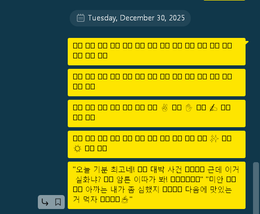
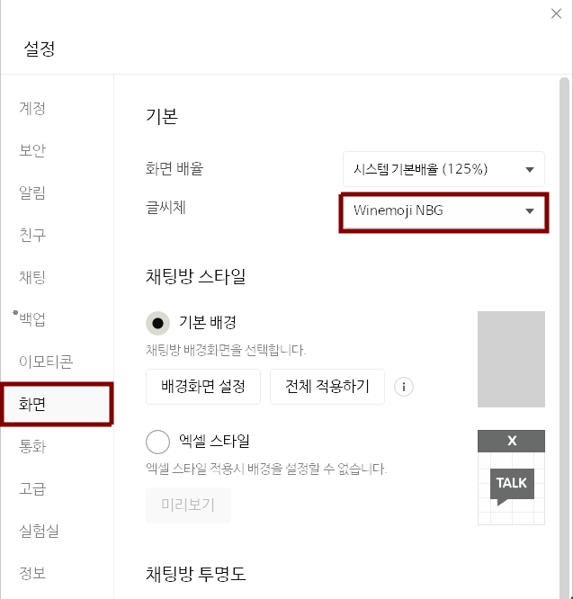
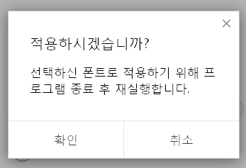
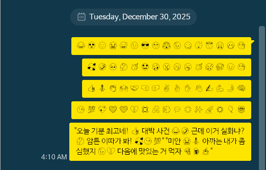

# 🍷 project-winemoji 😂


## Winemoji: Specialized font for resolving emoji rendering errors in wine environments

🍷😂 **Winemoji**는 리눅스의 Wine 환경에서 카카오톡과 같은 윈도우 기반 앱을 사용할 때 이모지 폰트가 깨지는(tofu) 문제를 해결하기 위해 제작된 특수 목적 폰트입니다. 기존에 이러한 문제로 불편함을 겪고 있던 분들에게 최적의 사용 환경을 제공하는 것을 목표로 시작되었습니다.

**Winemoji** is a specialized font designed to resolve the issue of broken emoji fonts (tofu) when using Windows-based applications like KakaoTalk within the Wine environment on Linux systems. It was created with the goal of providing an optimal user experience for those who have previously encountered inconvenience due to this problem.



## 설치 방법

1. 본 repository에서 `Winemoji-NBG.ttf` 파일을 다운로드합니다.
2. 리눅스 시스템의 폰트 폴더로 파일을 이동합니다.
    ```bash
    mkdir -p ~/.local/share/fonts
    cp Winemoji-NBG.ttf ~/.local/share/fonts/
    ```
3. 폰트 캐시를 갱신합니다.
    ```bash
    fc-cache -fv
    ```

### 💬 카카오톡 적용 방법



1. ⚙️ → **설정** → **화면** → **기본** → **글씨체** 메뉴로 이동합니다.
2. 글씨체 선택에서 **Winemoji NBG** (or **와인모지 NBG**)를 선택합니다.
3. 카카오톡을 재시작하면 한글과 이모지가 정상적으로 출력되는 것을 확인할 수 있습니다.



> 해당 구현 방식의 한계로 low surrogate 영역에 해당하는 1,024개의 이모지만 사용 가능합니다. Apple의 자체 조합형 이모지나 일부 최신 이모지들의 경우 **여전히 표시되지 않을 수** 있습니다.


## Why not color emojis?

본 프로젝트에서 컬러 이모지(Noto Color Emoji 등)를 사용하지 않고 흑백(Noto Emoji)을 선택한 이유는 다음과 같습니다.

- **Wine GDI의 기술적 한계**: 이 프로젝트의 핵심 목표는 리눅스 Wine의 구형 GDI 렌더러 호환성 확보입니다. GDI는 최신 컬러 폰트 규격(CBDT/CBLC, SBIX 등)을 정상적으로 처리하지 못하며, 컬러 데이터를 강제로 병합할 경우 폰트 자체가 인식되지 않거나 레이아웃 붕괴가 발생할 수 있습니다.

- **렌더링 안정성**: 흑백 outline 폰트는 폰트 크기나 해상도에 관계없이 벡터 방식으로 선명하게 렌더링됩니다. 이는 비트맵 기반이 섞인 컬러 이모지보다 저해상도 Wine 환경에서 훨씬 높은 가독성과 안정성을 제공합니다.

- **파일 최적화 및 복잡성 제거**: 컬러 레이어를 병합하는 공정은 폰트 파일의 용량을 증가시키며, 수동으로 크기를 조절하는 과정에서 데이터가 손실될 위험이 큽니다. 본 프로젝트는 실용성과 확실한 문제 해결을 위해 안정적인 흑백 폰트를 소스로 채택했습니다. 실제 Windows PC 카카오톡도 흑백 이모지만 지원하고 있습니다.

## 구현 원리

리눅스 Wine의 GDI renderer(`gdi32.dll`)는 유니코드 Plane 1 이상의 이모지(`U+1Fxxx` 등)를 정상적으로 렌더링하지 못하는 고질적인 문제가 있습니다. 카카오톡 PC버전의 텍스트 영역(입력란을 제외한)의 경우 모두 이 `gdi32.dll`을 사용하여 텍스트를 출력하도록 개발되었습니다. 이에 따라 wine 환경 상의 PC버전 카카오톡에서는 하나의 이모지가 두 개의 surrogate font로 출력됩니다. 일반적인 폰트 파일의 경우 이 surrogate 영역에 폰트를 mapping하는 경우는 없기에, 사용자 입장에서는 이모지가 두 개의 사각형 등으로 깨져서 보이게 됩니다. 이 문제를 해결하기 위해 본 프로젝트는 다음과 같은 우회로를 설계했습니다.

- **Low Surrogate 매핑:** Plane 1의 이모지 데이터들을 BMP(Basic Multilingual Plane) 영역 내의 **Low Surrogate (`U+DC00` ~ `U+DFFF`)** 대역에 강제 복제시켰습니다.
- **서열 정리 logic:** 동일한 Surrogate 슬롯을 점유하려는 이모지들 간의 충돌을 방지하기 위해, 일상에서 좀 더 자주 사용되는 얼굴 표정 이모지(🤣 등)에 높은 가중치를 부여하는 자체적인 **Priority Logic**을 적용했습니다.
- **High Surrogate 공백**: High Surrogate의 역할이 없어지므로, 폭 값이 `0`인 공백 문자로 1,024개의 영역을 채워주었습니다.
- **메트릭스 동기화:** 나눔바른고딕의 **Ascent 800 / Descent 200** 규격에 맞춰 이모지 크기를 일괄 조정하였습니다.

### How to build my own Winemoji? (Replication)

기본적으로 라이선스상 폰트 편집 문제에서 자유롭고, 적용했을 때 글꼴이 선명하게 렌더링되는 특징을 가진 나눔바른고딕을 선택하여 그 기반으로 제작하였으나, 이외의 다른 폰트를 base로 삼기를 원한다면 아래 절차를 따르십시오.

```bash
sudo apt update
sudo apt install fontforge
```

1. **준비:** **FontForge**를 설치하고 베이스가 될 폰트와 소스 이모지 폰트를 준비합니다.
2. **이름 변경:** 라이선스 준수 및 시스템 충돌 방지를 위해 **Font Info**에서 폰트 이름을 고유한 이름(예: `MyEmoji-NBG`)으로 변경합니다.
3. **스크립트 실행:** 아래의 FontForge python script를 실행하여 이모지를 Low Surrogate 영역으로 복사합니다.
    - Priority 함수를 통해 🤣(U+1F923)와 같은 이모지가 🔣(U+1F523)와 같은 이모지들에 비해 higher priority를 갖도록 설정하는 것이 도움이 될 수 있습니다.
4. **크기 조정:** 복사된 이모지들을 전체 선택하여 **Element → Transformations** 메뉴에서 베이스 폰트의 EM Size에 맞게 크기를 조절합니다.

## Fontforge Paste Python Script
```py
import fontforge

def get_priority(cp):
    if (0x1F600 <= cp <= 0x1F64F) or (0x1F900 <= cp <= 0x1F9FF):
        return 120
    if (0x1F300 <= cp <= 0x1F5FF) or (0x1F1E6 <= cp <= 0x1F1FF):
        return 100
    if (0x1FA00 <= cp <= 0x1FAFF):
        return 80
    if (0x10000 <= cp < 0x20000):
        return 50
    return 0

def migrate_emojis():
    font = fontforge.activeFont()
    if not font: return

    font.reencode('UnicodeFull')
    migration_plan = {}

    print("Starting emoji mapping to Low Surrogate area...")

    for glyph in font.glyphs():
        cp = glyph.unicode
        if cp < 0x10000 or cp >= 0x20000: continue
        
        priority = get_priority(cp)
        if priority == 0: continue

        target_low = 0xDC00 + (cp - 0x10000) % 0x400
        
        if target_low not in migration_plan or priority > migration_plan[target_low][0]:
            migration_plan[target_low] = (priority, cp)

    count = 0
    for target_low, (priority, source_cp) in migration_plan.items():
        try:
            font.selection.select(source_cp)
            font.copy()
            
            if target_low not in font: font.createChar(target_low)
            font.selection.select(target_low)
            font.paste()
            
            count += 1
        except:
            continue

    font.changed = True
    font.redraw()
    print(f"Process complete: {count} emojis mapped.")
    fontforge.postError("Complete", f"{count} emojis have been mapped to Low Surrogate area. Please adjust metrics in the GUI.")

migrate_emojis()
```

## 🛠 Tested Environment

| | Version
| - | -
| OS | Ubuntu 22.04 LTS
| GNOME | GNOME Shell 42.9 (Wayland)
| HW | Lenovo ThinkPad X13 Gen1
| wine | wine-10.0
| Verified Apps | KakaoTalk (x64)

## License

This font project is distributed under the **SIL Open Font License 1.1**.

- **NanumBarunGothic**: Copyright (c) 2013 NHN Corporation. Licensed under SIL OFL 1.1.
- **Noto Emoji**: Copyright (c) Google Inc. Licensed under SIL OFL 1.1.
- **Winemoji Modifications**: Copyright (c) 2025 by [KeyBaseZone](https://kmbzn.com). Licensed under SIL OFL 1.1.

Permission is hereby granted, free of charge, to any person obtaining a copy of the Font Software, to use, study, copy, merge, embed, modify, redistribute, and sell modified and unmodified copies of the Font Software, subject to the conditions set forth in the SIL OFL 1.1.
