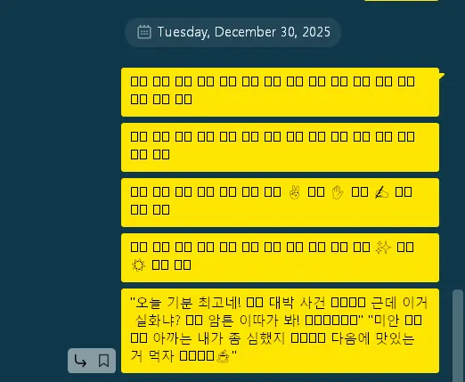
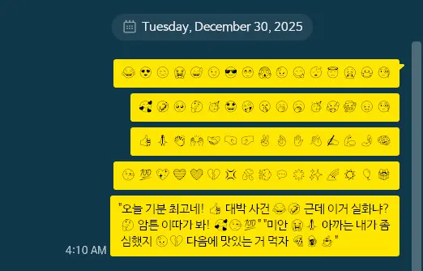
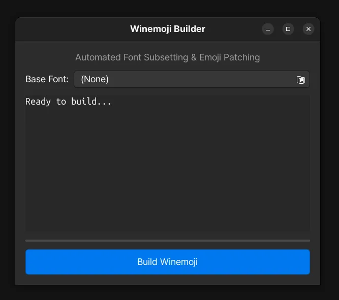
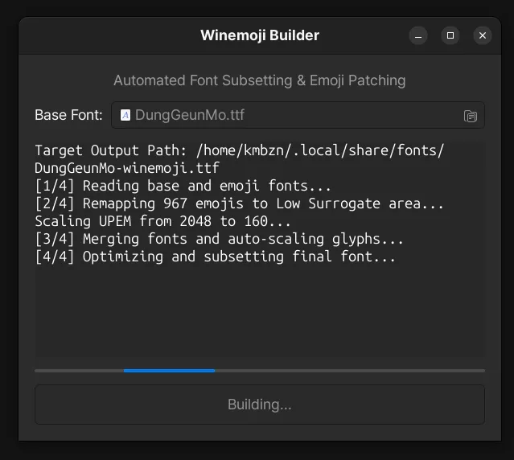
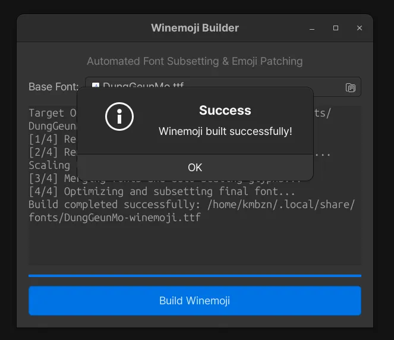
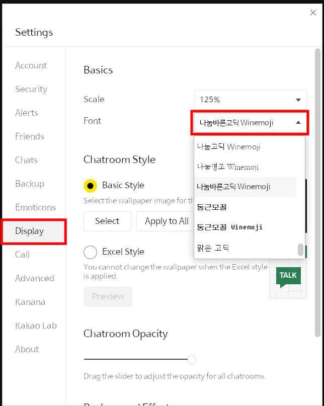
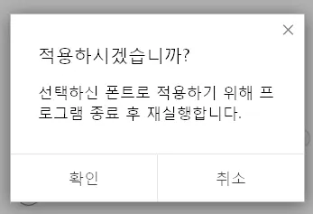

# 🍷 project-winemoji 😂

<p align="center">
  
</p>

## Winemoji: Universal tool for resolving emoji rendering errors in Wine environments

🍷😂 **Winemoji**는 리눅스의 Wine 환경에서 카카오톡과 같은 윈도우 앱을 사용할 때 이모지 폰트가 깨지는(tofu) 문제를 해결하기 위해 고안된 **자동화 폰트 빌더(GUI Builder)** 프로젝트입니다.

***Winemoji** is an **automated font builder (GUI Builder)** project designed to solve the problem of emoji fonts breaking (tofu) when using Windows apps like KakaoTalk in a Wine environment on Linux.*

<p align="center">
  
  
</p>

리눅스의 GDI 렌더러가 지원하지 못하는 이모지 데이터를 분석하여, 어떤 폰트든 Wine 환경에서 이모지가 정상적으로 표시되도록 패치해 줍니다.

추가로, 빌더를 직접 돌리기 번거로운 사용자들을 위해 저작권 문제로부터 자유로운 **10종의 무료 한글 폰트 Pre-built 파일**도 함께 제공합니다. (폰트 목록은 추후 업데이트를 통해 변경될 수 있습니다.)

## 1. 폰트만 바로 사용하기

빌더를 직접 실행하지 않아도, 폰트만 적용할 수 있도록 저작권 이슈로부터 자유로운 한글 폰트 10종에 이모지를 미리 적용하여 `fonts/` 폴더에 담아두었습니다. (폰트 목록은 추후 업데이트를 통해 변경될 수 있음)

### 제공되는 10종 폰트 목록

| 분류 | 폰트 이름 | 다운로드 링크 |
| :--- | :--- | :--- |
| **나눔 계열** | 나눔고딕 | [`NanumGothic-winemoji.ttf`](fonts/NanumGothic-winemoji.ttf) |
| | 나눔명조 | [`NanumMyeongjo-winemoji.ttf`](fonts/NanumMyeongjo-winemoji.ttf) |
| | 나눔바른고딕 | [`NanumBarunGothic-winemoji.ttf`](fonts/NanumBarunGothic-winemoji.ttf) |
| **고딕 계열** | 프리텐다드 | [`Pretendard-Regular-winemoji.ttf`](fonts/Pretendard-Regular-winemoji.ttf) |
| | IBM Plex Sans KR | [`IBMPlexSansKR-winemoji.ttf`](fonts/IBMPlexSansKR-winemoji.ttf) |
| **개성있는 폰트** | 주아 | [`Jua-winemoji.ttf`](fonts/Jua-winemoji.ttf) |
| | 도현 | [`DoHyeon-winemoji.ttf`](fonts/DoHyeon-winemoji.ttf) |
| | 해바라기 | [`Sunflower-winemoji.ttf`](fonts/Sunflower-winemoji.ttf) |
| | 고운돋움 | [`GowunDodum-winemoji.ttf`](fonts/GowunDodum-winemoji.ttf) |
| | 검은고딕 | [`BlackHanSans-winemoji.ttf`](fonts/BlackHanSans-winemoji.ttf) |

### 설치 방법
1. 저장소의 `fonts/` 폴더에서 원하는 폰트를 다운로드합니다.
2. 리눅스 시스템의 폰트 폴더로 복사하고 폰트 캐시를 갱신합니다.
    ```bash
    mkdir -p ~/.local/share/fonts
    cp fonts/Pretendard-Regular-winemoji.ttf ~/.local/share/fonts/
    fc-cache -fv
    ```

## 2. Builder (직접 폰트 커스텀하기)

**Winemoji Builder**를 사용하면, 사용자가 적용하고자 하는 폰트에 이모지를 손쉽게 병합할 수 있습니다. GUI 프로그램 또는 명령어(CLI)를 통해 이용할 수 있습니다.

> [!WARNING]  
> **라이선스 주의사항 (License Compliance)**  
> Winemoji Builder를 사용하여 폰트를 병합 및 수정할 때는 **반드시 원본 폰트의 라이선스(저작권)를 확인하고 준수하셔야 합니다.**  
> 개인적인 용도로만 수정이 허용되는지, 재배포가 불가능한 상용 폰트인지 등을 확인하시기 바라며, 이로 인해 발생하는 모든 저작권 분쟁의 책임은 사용자 본인에게 있습니다. 가급적 OFL(Open Font License) 계열의 폰트 사용을 권장합니다.

### 2.1. GUI 실행 방법 (창 모드)

```bash
cd builder
./run.sh
```
본 repository를 `git clone`한 후 터미널에서 위 명령어를 실행하면 GUI 창이 열립니다. 'Base Font' 드롭다운 메뉴를 클릭하여 폰트를 선택하세요.

### 2.2. CLI 실행 방법 (명령어 모드)

터미널에서 `winemoji` 명령어를 사용하는 것도 가능합니다.

#### 2.2.1. 명령어 등록(설치) 방법
터미널 어디서나 `winemoji` 명령어를 실행할 수 있도록 설치를 진행합니다.

**원라인 간편 설치 (추천):**
```bash
curl -fsSL https://raw.githubusercontent.com/kmbzn/project-winemoji/main/install.sh | bash
```

**수동 설치:**
본 repository를 `git clone`한 후, 프로젝트 폴더 내부에서 아래 명령어를 실행하여 수동으로 설치합니다.
```bash
./winemoji --install
```

> [!NOTE]  
> 위 명령어를 실행하면 `~/.local/share/winemoji` 경로에 프로젝트가 설치되고, 사용자 계정의 `~/.local/bin/winemoji` 경로에 심볼릭 링크가 생성됩니다. 해당 경로가 시스템 환경변수 `PATH`에 등록되어 있는지 확인해 주세요. 등록되어 있지 않다면 `export PATH="$HOME/.local/bin:$PATH"`를 셸 설정 파일(예: `.bashrc`, `.zshrc`)에 추가하세요.

#### 2.2.2. 명령어 사용법
```bash
# 도움말 및 사용 가능 옵션 확인
winemoji --help

# 기본 사용법 (원본 폰트 지정, 결과물은 원본 폰트와 같은 경로에 생성)
winemoji -b /path/to/font.ttf

# 출력 경로 직접 지정
winemoji -b /path/to/font.ttf -o /custom/path/output.ttf

# 다른 이모지 폰트 소스 사용
winemoji -b /path/to/font.ttf -e /path/to/custom_emoji.ttf
```

<p align="center">
  
</p>

### 2.3. 폰트 병합 진행
하단의 **Build Winemoji** 버튼을 클릭하면 폰트 병합이 진행됩니다. 

<p align="center">
  
</p>

### 2.4. 완료
성공적으로 빌드가 완료되면 결과물은 자동으로 기존 폰트가 있는 경로에 저장됩니다. (권한 문제로 저장이 불가한 경우 `~/.local/share/fonts` 에 저장)

<p align="center">
  
</p>

## 3. 카카오톡 적용 방법
1. 카카오톡 설정 창(⚙️ → 설정 → 화면 → 기본 → 글씨체)을 엽니다.
2. 글씨체 목록에서 **설치하신 폰트 이름 + Winemoji** (예: `Pretendard Regular Winemoji`)를 선택합니다.
  <p align="center">
    
  </p>
3. 카카오톡을 재시작하면 한글과 흑백 이모지가 정상적으로 출력됩니다.
  <p align="center">
    
  </p>

## Why not color emojis?
본 프로젝트에서는 컬러 이모지 계열을 사용하지 않고 흑백(Noto Emoji)을 채택했습니다.

- **Wine GDI의 한계**: 이 프로젝트의 목표는 리눅스 Wine의 구형 GDI 렌더러 호환성 확보입니다. GDI는 최신 컬러 폰트 규격(`CBDT/CBLC`, `SBIX` 등)을 처리하지 못하며, 컬러 데이터를 강제로 병합할 경우 폰트 자체가 인식되지 않거나 카카오톡 등 윈도우 프로그램이 마비되는 문제가 발생할 수 있습니다.

- **렌더링 안정성**: 흑백 outline 폰트는 폰트 크기나 해상도에 관계없이 벡터 방식으로 선명하게 렌더링됩니다. 이는 비트맵 정보가 포함된 컬러 이모지보다 저해상도 Wine 환경에서 보다 높은 가독성과 안정성을 제공합니다.

- **파일 최적화 및 복잡성 제거**: 컬러 레이어를 병합하는 과정은 폰트 파일의 용량을 증가시키며, 수동으로 크기를 조절하는 과정에서 데이터가 손실될 위험이 존재합니다. 본 프로젝트는 실용성과 문제 해결에 집중하기 위해 상대적인 안정적인 흑백 폰트를 소스로 채택했습니다. 실제 Windows PC 카카오톡도 흑백 이모지만 지원하고 있습니다.

## 구현 원리
Winemoji Builder는 카카오톡(Wine GDI)에서 렌더링 오류를 일으키는 원인들을 완벽하게 해결하는 구조를 가지고 있습니다.

1. **Low Surrogate 강제 매핑 (`U+DC00` ~ `U+DFFF`)**: Wine GDI는 Plane 1 이상의 이모지를 제대로 그리지 못하고 두 개의 Surrogate 문자로 분리하여 출력합니다. Winemoji는 원본 이모지를 Low Surrogate 영역에 매핑하여 이모지 깨짐 현상을 해결합니다.
2. **충돌 방지**: Surrogate 영역 공간 한계(1,024개)로 인해 발생하는 충돌을 막기 위해, 한국인이 주로 쓰는 얼굴 표정이나 손동작 등에 높은 가중치를 두어 중요한 이모지들이 반영될 수 있도록 합니다.
3. **국기 및 Ligature 지원**:
   - `GSUB`, `GDEF` 등 폰트 테이블을 유지시켜, **국기 이모지(🇰🇷)처럼 2개의 글자가 조합되어 만들어지는 이모지**도 완벽하게 지원합니다.
   - 국기 조합용 알파벳(Regional Indicators)은 가로세로 비율을 유지한 채 60% 크기로 스케일링하고, 폰트 사이에 빈 공간이 생기지 않도록 Kerning을 적용했습니다.
4. **High Surrogate 공백 제거**:
   - 렌더링 과정에서 발생하는 High Surrogate 문자들을 막기 위해, **Advance Width가 0인 투명 glyph**를 생성하여 덮어씌웁니다. 이모지 옆에 띄어쓰기 한 칸이 강제로 벌어지는 현상이 해결됩니다.
5. **Auto-Scaling 및 Fallback 시스템**:
   - 베이스 폰트의 해상도(UPEM)를 감지하고, 이모지 폰트의 모든 벡터 좌표를 이에 맞게 auto-scaling합니다.
   - 폰트 병합 중 `fontTools` 자체 문제로 인해 에러가 발생할 경우, 백그라운드에서 이를 감지하고 에러를 유발하는 테이블을 분리한 뒤 자동으로 fallback하도록 구성했습니다.

## Technical Implementation Details
Winemoji Builder resolves emoji rendering errors in Wine environments (such as KakaoTalk Wine GDI) through the following mechanisms:

1. **Forced Low Surrogate Mapping (`U+DC00` ~ `U+DFFF`)**: Wine GDI fails to render emojis in Plane 1 and higher, splitting them into two surrogate characters. Winemoji maps the original emojis to the Low Surrogate area to resolve this display bug.
2. **Conflict Prevention**: To prevent glyph conflicts due to the space limit of the Surrogate area (1,024 slots), higher weights are assigned to frequently used face expressions and hand gestures to prioritize key emojis.
3. **Flags and Ligature Support**:
   - Preserves font tables such as `GSUB` and `GDEF` to fully support combined glyphs like flag emojis (🇰🇷).
   - Regional indicator letters used for flags are scaled down to 60% while maintaining aspect ratio, and kerning is applied to eliminate spacing gaps.
4. **High Surrogate Remnant Removal**:
   - To prevent rendering ghost remnants from High Surrogate characters, a transparent glyph with 0 advance width is generated to override them, fixing the issue of unexpected blank spaces appearing next to emojis.
5. **Auto-Scaling & Fallback System**:
   - Detects the base font resolution (UPEM) and automatically scales all vector coordinates of the emoji font to match.
   - If an error occurs due to `fontTools` limitations during font merging, the system automatically isolates the problematic table and falls back gracefully.

## Environment & Specifications

| Component | Version / Specification |
| :--- | :--- |
| **Project Version** | `1.0` |
| **OS** | `Ubuntu 24.04 LTS` |
| **Desktop** | `GNOME 46.0` |
| **Wine** | `Wine 11.0` |
| **Python** | `Python 3.12.3` |

## License

This project (Winemoji Builder source code and script tools) is distributed under the **MIT License**.

- **Winemoji Builder & Modifications**: Copyright (c) 2026 by [KeyBaseZone](https://kmbzn.com). Licensed under the **MIT License**.

However, the fonts processed, merged, or bundled by this project are subject to their respective original licenses:

- **Noto Emoji**: Copyright (c) Google Inc. Licensed under the **SIL Open Font License 1.1**.
- **Disclaimer**: We only provide a tool for modifying font files. We do not claim any ownership or copyright over the original base fonts or emoji fonts used in this project. All original fonts remain the property of their respective creators and are subject to their original licenses.